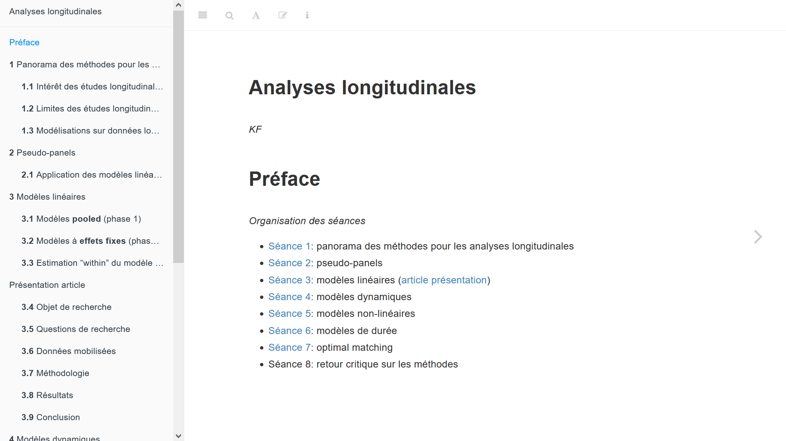
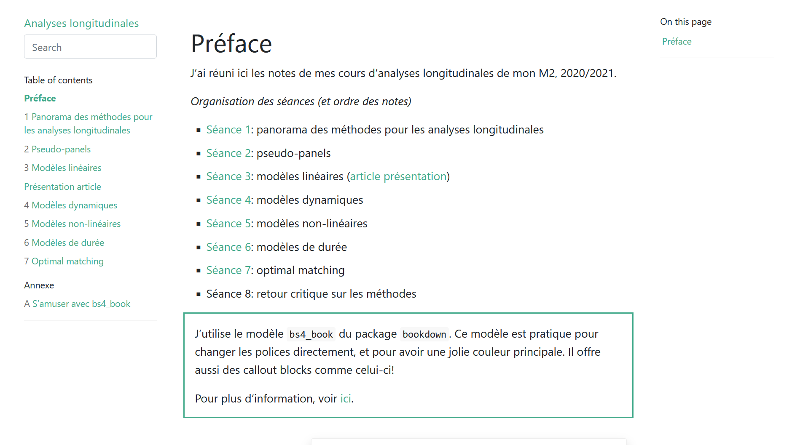

# (APPENDIX) Annexe {-}

# S'amuser avec `bs4_book`

À mon avis, `bs4_book` est plus cool que `gitbook`. Si j'avais lu plus attentivement [la documentation officielle](https://bookdown.org/yihui/bookdown/html.html), j'aurais découvert encore plus de tips :)

Better late than never innit.

::: {.rmdcaution}
Attention!
:::

::: {.rmdimportant}
Important!
:::

::: {.rmdtip}
Conseil!
:::

::: {.rmdwarning}
Encore attention!
:::

Différence entre l'ancien thème et le nouveau:

```{r theme-old, out.width="100%"}

```

```{r theme-new, out.width="100%"}

```

